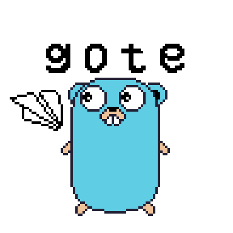

# gote — Telegram Bot API for Go



**gote** is a modern, minimalist, and developer-friendly library for working with the Telegram Bot API in **Go**.
It provides full access to all Telegram features: 
- messages,
- media,
- keyboards,
- commands,
- callback queries,
- webhooks,
- inline mode,
- and much more.

[Bot API 10.0](https://core.telegram.org/bots/api#may-8-2026) released on May 8, 2026.

---

## Installation

```bash
go get github.com/WORKHATERS/gote
```

---

## Quick Start

```go
package main

import (
	"context"

	"github.com/WORKHATERS/gote/pkg/core"
	"github.com/WORKHATERS/gote/pkg/types"
	"github.com/WORKHATERS/gote/pkg/updater"
)

func main() {
	ctx, cancel := context.WithCancel(context.Background())
	defer cancel()

	bot := core.NewBot(ctx, "YOUR_BOT_TOKEN")

	poller := updater.NewPoller(bot)
	updates := poller.Start()

	for u := range updates {
		if u.Message != nil {
			bot.SendMessage(ctx, types.SendMessage{
				ChatId: u.Message.Chat.Id,
				Text:   u.Message.Text,
			})
		}
	}
}
```

---

## Architecture

The library is divided into the following packages:

| Package       | Purpose                                                                                               |
| ------------- | ----------------------------------------------------------------------------------------------------- |
| `pkg/core`    | Core `Bot` object, API methods, request handling, and logging.                                        |
| `pkg/updater` | Update receiving mechanism (polling or webhook).                                                      |
| `pkg/types`   | Data structures corresponding to the Telegram Bot API (messages, media, chats, users, buttons, etc.). |

---

## Key Features

* Send and edit messages
* Work with inline and reply keyboards
* Callback queries and inline mode
* Send photos, videos, documents, and media groups
* Webhook and long polling support
* Manage commands, chats, and users
* Built-in logging system
* Fully typed Telegram API objects

---

## How It Works

1. **Create a bot instance:**

   ```go
   bot := core.NewBot(ctx, token)
   ```

2. **Start receiving updates:**

   ```go
   poller := updater.NewPoller(bot)
   updates := poller.Start()
   ```

3. **Handle updates:**

   ```go
   for update := range updates {
       if update.Message != nil {
           bot.SendMessage(ctx, ...)
       }
       if update.CallbackQuery != nil {
           bot.AnswerCallbackQuery(ctx, ...)
       }
       // and so on
   }
   ```

---

## Why gote?

* **Minimalist:** clean and straightforward API without unnecessary abstractions
* **Flexible:** easy to integrate into any project
* **Full Control:** access every field exposed by the Telegram API
* **Extensible:** configurable HTTP client and logger

---

## Examples

Examples are available in the [`examples/`](examples/) directory.

---

## License

MIT License © 2025 WORKHATERS
